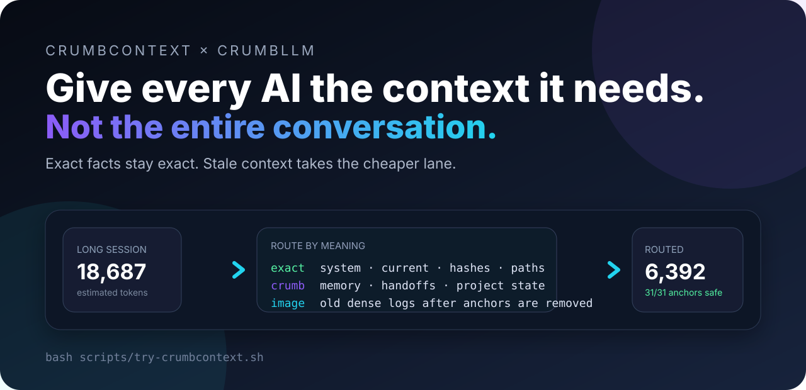
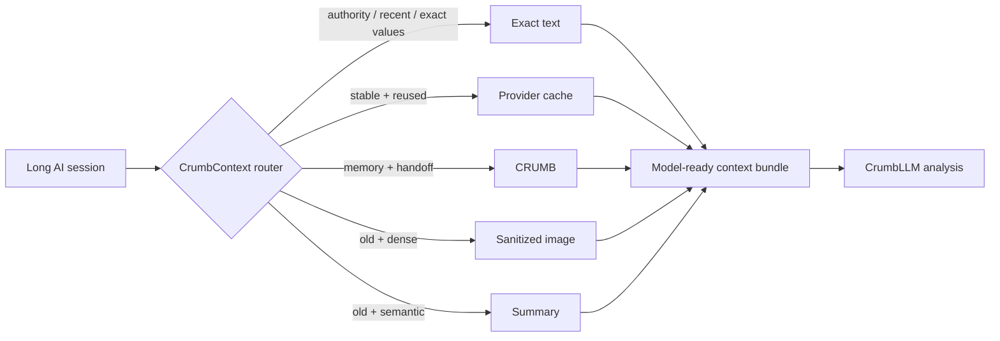

<p align="center">
  
</p>

<p align="center">
  <a href="https://github.com/XioAISolutions/CrumbLLM/actions/workflows/crumbcontext.yml"></a>
  <a href="https://github.com/XioAISolutions/CrumbLLM/actions/workflows/ci.yml"></a>
  
  
  
</p>

<p align="center">
  <strong>The open context stack for AI agents.</strong><br>
  CrumbContext decides what must stay exact, what belongs in memory, and what can be compressed.<br>
  CrumbLLM reads the resulting CRUMBs and turns them into useful work.
</p>

<p align="center">
  <a href="https://codespaces.new/XioAISolutions/CrumbLLM?quickstart=1"><strong>Open in Codespaces</strong></a>
  ·
  <a href="#-try-it-now"><strong>Run the benchmark</strong></a>
  ·
  <a href="#-bring-your-own-context"><strong>Route your transcript</strong></a>
  ·
  <a href="https://github.com/XioAISolutions/crumb-format"><strong>Read the CRUMB spec</strong></a>
</p>

---

## ⚡ Try it now

Clone the repo and run one command:

```bash
bash scripts/try-crumbcontext.sh
```

CrumbContext creates a local proof bundle and opens an interactive report:

```text
crumbcontext-proof/
├── report.html          ← inspect every routing decision
├── share-card.svg       ← post the result
├── benchmark.json       ← machine-readable self-check
├── plan.json            ← lane, reason, and token estimate per block
├── images/              ← sanitized historical context
├── crumbs/              ← exact anchors and structured memory
└── summaries/           ← deterministic stale-context summaries
```

Typical bundled demo result:

```text
CrumbContext benchmark: PASS
Estimated tokens: 18,687 -> 6,392 (65.8% reduction)
Exact anchors: 31/31 preserved
```

> **Honest benchmark note:** these are deterministic planning estimates, not provider billing records. CrumbContext refuses to turn an estimate into a fake savings claim.

## 🧠 What just happened?

CrumbContext examined each context block and chose a lane based on authority, recency, structure, density, and reuse.

| Lane | What goes there | Why |
|---|---|---|
| `exact` | system/developer instructions, current turns, policies, approvals | authority cannot become fuzzy |
| `cache` | stable reference material used repeatedly | reuse beats retransmission |
| `crumb` | project memory, handoffs, maps, decisions | structured context survives tool switching |
| `image` | old dense logs and tool output | compact, but only after exact values are removed |
| `summary` | old semantic context | preserve meaning without carrying every word |

Before any lossy transform, CrumbContext extracts paths, hashes, UUIDs, URLs, emails, dates, amounts, environment variables, and long identifiers into native-text **exact-anchor CRUMBs**.



## 🎮 Pick your path

<details open>
<summary><strong>I want the fastest possible demo</strong></summary>

```bash
bash scripts/try-crumbcontext.sh
```

Or click **Open in Codespaces**, then run:

```bash
crumbcontext benchmark --out proof --open
```

</details>

<details>
<summary><strong>I want to route my own context</strong></summary>

Create `transcript.json`:

```json
{
  "blocks": [
    {
      "id": "system",
      "role": "system",
      "kind": "instruction",
      "content": "Never deploy without approval.",
      "authoritative": true
    },
    {
      "id": "old-log",
      "role": "user",
      "kind": "tool_result",
      "content": "...large historical output...",
      "age_turns": 12
    },
    {
      "id": "now",
      "role": "user",
      "kind": "message",
      "content": "Fix the test and preserve SHA abcdef1234567890.",
      "age_turns": 0
    }
  ]
}
```

Then run:

```bash
cd incubator/crumbcontext
python -m pip install -e .
crumbcontext analyze ../../transcript.json
crumbcontext route ../../transcript.json --out ../../routed --open
```

</details>

<details>
<summary><strong>I want AI to understand a CRUMB pack</strong></summary>

```bash
pip install crumb-llm
crumblm analyze path/to/session.crumb
crumblm analyze-pack path/to/crumb-pack
crumblm risks path/to/crumb-pack --format json
crumblm next path/to/crumb-pack
```

CrumbLLM supports OpenAI, Anthropic, Ollama, LM Studio, and a built-in offline mock provider. It bundles its own CRUMB reader and requires no cloud key for the default path.

</details>

<details>
<summary><strong>I want to build a provider adapter</strong></summary>

Start with the invariants in [`incubator/crumbcontext/docs/ARCHITECTURE.md`](incubator/crumbcontext/docs/ARCHITECTURE.md):

1. Never move system authority into ordinary user content.
2. Extract exact anchors before summaries or images.
3. Label compressed history as non-authoritative.
4. Measure the same request before and after routing.
5. Fall back to exact text when confidence drops.

The next high-value adapters are Anthropic Messages, OpenAI Responses, and an OpenClaw localhost bridge.

</details>

## 🧩 Two products, one context stack

### CrumbContext — route before you reason

The launch candidate lives in [`incubator/crumbcontext/`](incubator/crumbcontext/).

```bash
cd incubator/crumbcontext
python -m pip install -e '.[dev]'
pytest -q
crumbcontext benchmark --out proof
```

It is currently a provider-neutral router and artifact generator—not yet a transparent network proxy. That boundary is deliberate: provider adapters will only ship when role and authority semantics can be preserved.

### CrumbLLM — reason over portable memory

CrumbLLM reads individual `.crumb` files or CRUMB packs and produces:

- summaries;
- risk analysis;
- next actions;
- improved handoffs;
- structured JSON;
- dataset exports.

```bash
pip install crumb-llm
crumblm setup local --backend ollama --model llama3.1
crumblm analyze-pack examples/pack
```

Every result carries quality-gate warnings for invalid JSON, hallucinated paths, empty output, and generic non-answers.

## 🥖 The CRUMB ecosystem

```text
Crumb-Bob  ──captures sessions──▶  .crumb files
                                      │
crumb-format ──validates/specifies────┤
                                      ▼
CrumbContext ──routes + protects──▶ model-ready context
                                      │
                                      ▼
CrumbLLM ──summarizes / checks / plans / improves handoffs
```

| Project | Job |
|---|---|
| [`crumb-format`](https://github.com/XioAISolutions/crumb-format) | portable format, parser, validator, linter, CLI |
| [`Crumb-Bob`](https://github.com/XioAISolutions/Crumb-Bob) | session capture and CRUMB generation |
| **CrumbContext** | context routing, exact-anchor protection, proof bundles |
| **CrumbLLM** | local/cloud analysis over CRUMB files and packs |

## 🧪 Build challenge

Try to break the router with:

- confusing hashes such as `0O5S8B`;
- URLs containing long numeric IDs;
- repeated exact values across large logs;
- stale instructions that conflict with a current request;
- huge sparse prose that should not become an image;
- dense JSON that should.

Found a failure? Open an issue with the smallest reproducible fixture. A useful adversarial test is worth more than another feature checkbox.

## 🗺️ Launch roadmap

- [x] safety-first lane router
- [x] exact-anchor CRUMB sidecars
- [x] sanitized PNG context pages
- [x] deterministic summaries
- [x] interactive HTML report
- [x] self-verifying offline benchmark
- [x] shareable proof card
- [ ] same-request provider counterfactual harness
- [ ] Anthropic Messages adapter
- [ ] OpenAI Responses adapter
- [ ] local OCR/VLM render verification
- [ ] standalone `CrumbContext` repository and package release

## 🤝 Contributing

The project is small enough to understand and weird enough to matter. Start with:

```bash
git clone https://github.com/XioAISolutions/CrumbLLM.git
cd CrumbLLM/incubator/crumbcontext
python -m pip install -e '.[dev]'
pytest -q
crumbcontext benchmark --out proof
```

Good first contributions: new exact-anchor patterns, adversarial fixtures, routing heuristics, provider adapters, and clearer benchmark visualizations.

## License

MIT © XIO AI Solutions
